# HW1 线性模型

### 1 线性回归 Linear Regression（50）

#### 1.1 输入数据集 （10）

data1.txt为回归数据集，每一行为一个样本，前两列为特征，最后一列为目标值。按照7:3的比率划分训练集和验证集。
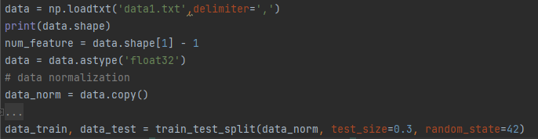
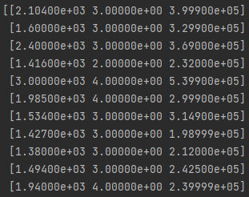
#### 1.2 线性回归（20）

建立线性回归模型，分别使用正规方程和梯度下降法求得参数解。

- 正规方程

$$
w=(X^TX)^{-1}X^Ty
$$
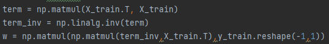

- 梯度计算

$$
g=\frac{1}{m}\sum^m_{i=1}(h_\theta(x^{(i)})-y^{(i)})x_j^{(i)}
$$
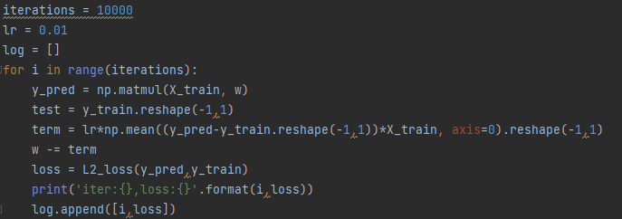
#### 1.3 可视化（20）

- 使用梯度下降法时请可视化loss曲线
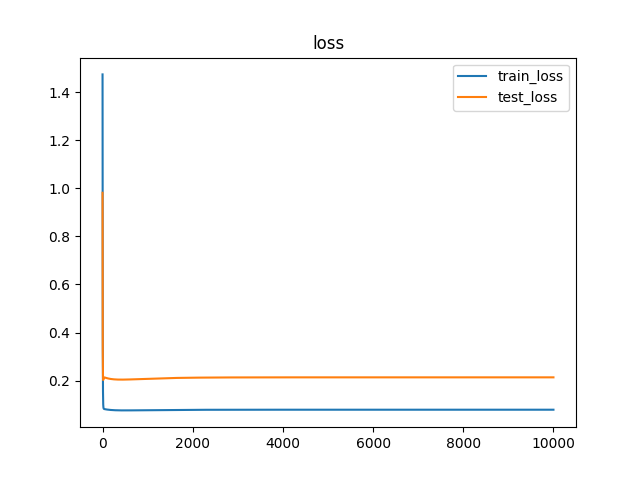
- 请可视化验证集上所求回归直线
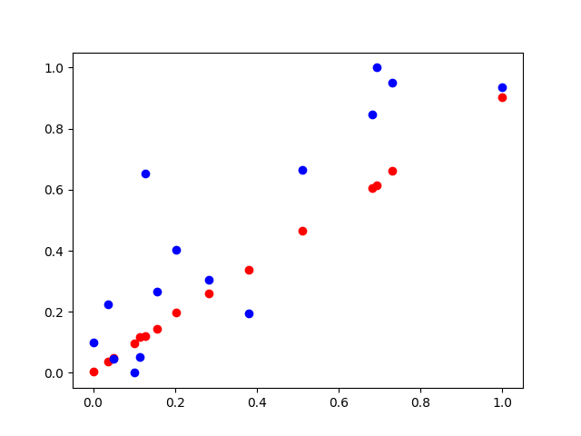
### 2 逻辑回归 Logitstic Regression/Percetron（50）

#### 1.1 输入数据集（10）

data2.txt为分类数据集，每一行为一个样本，前两列为特征，最后一列为目标值。按照7:3的比率划分训练集和验证集。
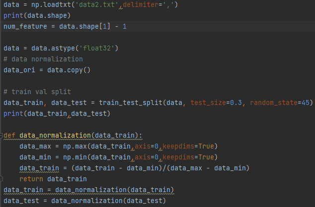
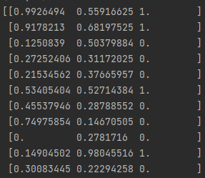
#### 1.2 逻辑回归（20）

建立逻辑回归模型，分别使用梯度下降法求得参数解。可尝试使用L2正则化。

- 梯度计算

$$
g=\frac{1}{m}\sum^m_{i=1}(h_\theta(x^{(i)})-y^{(i)})x_j^{(i)}
$$
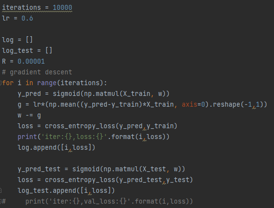
- 梯度计算（L2正则化）

$$
g_j=\frac{1}{m}\sum^m_{i=1}(h_\theta(x^{(i)})-y^{(i)})x_j^{(i)}+2*\lambda*\theta_j
$$
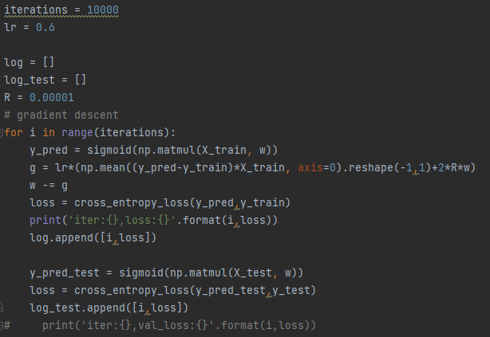
#### 1.3 可视化（20)

- 使用梯度下降法时请可视化loss曲线
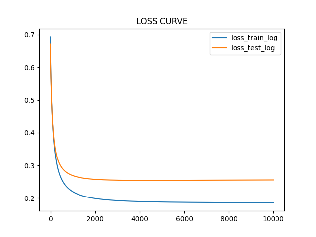
- 请可视化验证集上所求分类直线
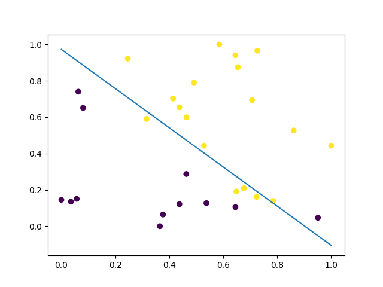
### 3 Bonus：分析 （10）

- 对比正规方程和梯度下降法，基于实验结果比较两者之间的优劣。
- 答：梯度训练2000个Epoch得到的W的值与正规方程直接求出的值的对比：

- 梯度训练5000个Epoch得到的W的值与正规方程直接求出的值的对比：

- 基于实验结果，对比没有正则化的情况和L2正则化的逻辑回归模型。
- 答：在逻辑回归模型中，没有使用正则化在一定情况下可能会导致过拟合的教易产生，而在实际情况中，我发现我们当前所写的逻辑回归模型正在正则化后的loss却还有些许的上升。
- 分析特征归一化和不做归一化对模型训练的影响。
- 答：使用了归一化的数据内容会更容易计算，并且也更规整。同样的，使用了特征的归一化能使得求最优解的过程变得平缓，更容易正确收敛，能有效提高梯度下降的速度。
- 
