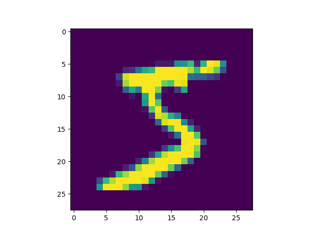
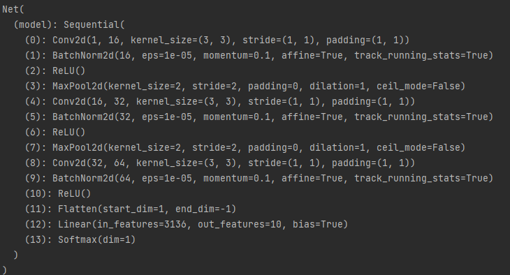
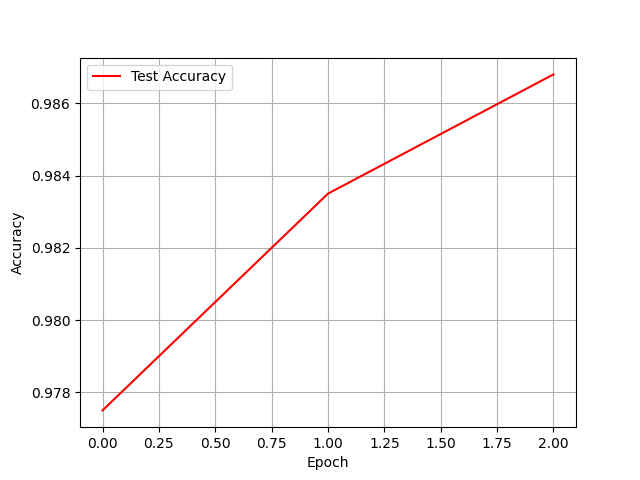

### 2 MNIST识别（90）

#### 2.1 输入数据集 （10）

data文件夹中是MNIST分类数据集，训练数据集包含 60000 个样本, 测试数据集包含 10000 样本。每个样本为单通道图片，长宽均为28。

分析处理：此次实验中的数据集需要在torchvision库中进行下载，下载完成后可在本地调用DataLoader对数据进行载入，载入的图片数据是以字节的形式进行存储, 我们需要把它们读取到 NumPy array 中, 以便训练和测试算法.
```python
trainData = torchvision.datasets.MNIST('./data/', train=True, transform=transform, download=True)
testData = torchvision.datasets.MNIST('./data/', train=False, transform=transform)

trainDataLoader = torch.utils.data.DataLoader(dataset=trainData, batch_size=BATCH_SIZE, shuffle=True)
testDataLoader = torch.utils.data.DataLoader(dataset=testData, batch_size=BATCH_SIZE)
```
#### 2.2 数据集可视化（20）

使用matplotlib工具包将数据集可视化。
这里的可视化操作先加载字节文件，然后再直接使用matplotlib进行显示，这里展示第一张样例：

#### 2.3 模型建立（20）

- 利用卷积层和线性层建立一个深度模型
- solution：在本次实验中使用了三个卷积大层和一个线性层搭建了一个深度模型，中间穿插了bathchnorm和Maxpolling,这里需要注意卷积大层经过Maxpooling之后需要改变图像的大小，最后卷积大层和线性层之间需要对数据进行一个Flatten操作，把多维数据拉伸成一维数据。
```python
class Net(nn.Module):
    def __init__(self):
        super(Net, self).__init__()
        self.model = nn.Sequential(
            # The size of the picture is 28x28
            nn.Conv2d(in_channels=1, out_channels=16, kernel_size=3, stride=1, padding=1),
            nn.BatchNorm2d(16),
            nn.ReLU(),
            nn.MaxPool2d(kernel_size=2, stride=2),

            # The size of the picture is 14x14
            nn.Conv2d(in_channels=16, out_channels=32, kernel_size=3, stride=1, padding=1),
            nn.BatchNorm2d(32),
            nn.ReLU(),
            nn.MaxPool2d(kernel_size=2, stride=2),

            # The size of the picture is 7x7
            nn.Conv2d(in_channels=32, out_channels=64, kernel_size=3, stride=1, padding=1),
            nn.BatchNorm2d(64),
            nn.ReLU(),


            nn.Flatten(),
#             torch.nn.Linear(in_features=7 * 7 * 16, out_features=32),
#             torch.nn.ReLU(),
            nn.Linear(in_features=7 * 7 * 64, out_features=10),
            nn.Softmax(dim=1)
        )
```

- 如果熟悉的同学，可以尝试其他层，例如dropout、batchnorm、layernorm、maxpooling等，具体的函数接口可以在官方文档中找到

#### 2.4 模型训练（20）

- 训练3个epoch，观察loss的变化

- 将loss可视化出来
- solution:loss的可视化图像如图所示

#### 2.5 性能测试（20）

- 将训练好的模型在测试集上进行测试，观察准确率
- solution：训练集的准确率如图所示,仅三次Epoch跑出来的最佳结果一般在0.98左右，在后续的训练中我将该项目的Epoch数量增加到10，准确率能上升到99%。
