# HW3 支持向量机

### 1 线性SVM（50）

#### 1.1 输入数据集 （10）

data1.mat为分类数据集，每一行为一个样本，前两列为特征，最后一列为目标值。按照7:3的比率划分训练集和验证集。

```python
data_train,data_test = train_test_split(np.hstack((data_base['X'],data_base['y'])),test_size=0.3,random_state=True)
len(data_base['X']),len(data_train),len(data_test)
```
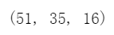

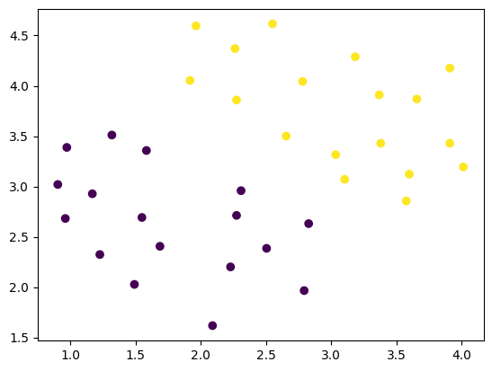

分析与解答：对训练集数据进行可视化可以看到data1中的训练数据呈现出2个特征的分布方式，后续拟采用SVM中的linear核函数进行分类。
data1中的眼本总数为51个，进行7:3划分之后，训练集中有样本35个，测试集样本有16个。

#### 1.2 模型训练（20）

使用sklearn工具包，调用SVM.linearSVC接口对模型进行训练。
```python
model = svm.LinearSVC(C = 20)
model.fit(data_train[:,:2],data_train[:,2].ravel())
score = model.score(data_train[:,:2],data_train[:,2])
```

分析与解答：在支持向量机模型调用中，直接使用svm.LinearSVC函数，在此次实验中参数选择为C=20，后续将已经分割完成的数据集中的训练集通过fit函数填入其中，再次调用model即可得到相应的参数，
C的值越大，决策边界的容忍度越低，同样的，C的值越小，决策边界的容忍度越高。
通过score函数可以查看模型在训练集中分类的准确度，在该训练集中的准确度为1，也就是100%分类正确。这里的C选择还是比较适宜的。

#### 1.3 分析（20）

- 可视化决策边界，并输出验证集准确率

当C= 20时的可视化决策边界如下图所示：

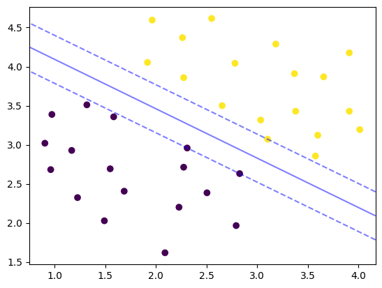

要获取到验证集的准确率需要调用socre函数传入验证集的数据

```python
model.score(data_test[:,:2],data_test[:,2].ravel())
```
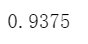

这里可以得到验证集的所有样本的准确率为0.9375，可视化样本集中的数据内容以及支持向量机训练出来的分类直线可以看到样本集中有一个样本是错误判断的。

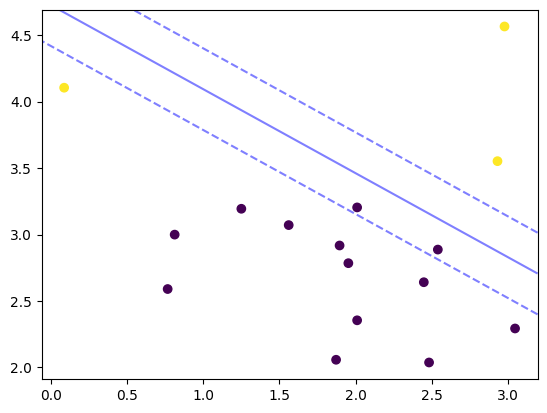

- 基于实验，分析软惩罚参数C对于决策边界的影响

当C = 1时的可视化决策边界如下图所示

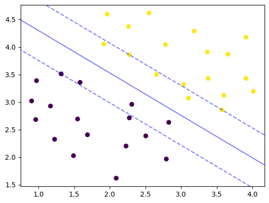

在本次实验中，调整惩罚参数C可以看到，当C = 1时，决策边界是包含了6个训练样本的，这里的6个训练样本就在决策边界的容忍度之内。

当调整C为20时，决策边界内一个训练样本也没有，分类直线的支持向量也相应改变了。
### 2 非线性SVM（50）

#### 1.1 输入数据集（10）

data2.mat为分类数据集，每一行为一个样本，前两列为特征，最后一列为目标值。按照7:3的比率划分训练集和验证集。
```python
data_train,data_test = train_test_split(np.hstack((data_base['X'],data_base['y'])),test_size=0.3,random_state=True)
len(data_base['X']),len(data_train),len(data_test)
```
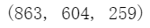

运行上面的代码可以得到在data2总共有863个样本，进行7:3分割之后可以得到一个拥有604个样本的训练集以及一个拥有259个样本的训练集

#### 1.2 模型训练（10）

- 使用sklearn工具包，调用SVM.SVC接口对模型进行训练，kernel选择rbf。
分析与解答：
在使用SVM.SVC接口，kernel选择rbf，在尝试1-100的惩罚参数C之后，最后选用了C=100,填充训练集对模型进行训练

可以得到C=1时的非线性分类图像如下：


可以得到C=100时的非线性分类图像如下：
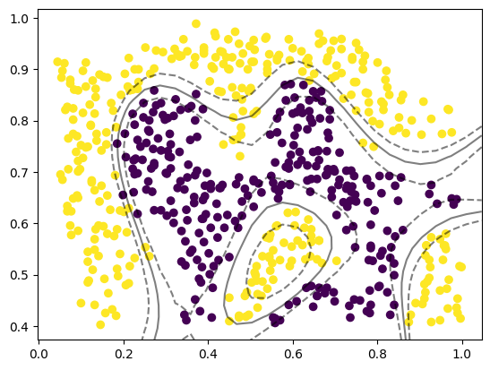

结论：从分类图像不难看出在使用惩罚参数C=100时的分类效果明显是要优与惩罚参数设置为1时的分类效果的。不难得出结论，在使用高斯kernel分类非线性数据
内容时，惩罚参数的大小会决定分类的效果：
- 惩罚参数在一定范围内越大，分类效果越好
- 惩罚参数越小，分类效果越差
#### 1.3 分析（30)

- 换用不同的kernel，分析不同kernel和不同参数值对于验证集准确率的影响。

分析与解答：在本次实验中，选择了两个kernel【‘rbf’，‘poly’】对模型进行训练，上文中已经提到过使用rbf作为核函数的模型训练效果，下面主要分析核函数
为ploy时的情况。

选用poly作为核函数的情况下，传入训练集样本数据，设置C = 100可以得到训练集的准确率为0.723，这相较于使用高斯核函数非常之低。
将训练集样本数据以及poly作为核函数分类出来的分类曲线可视化如下图：

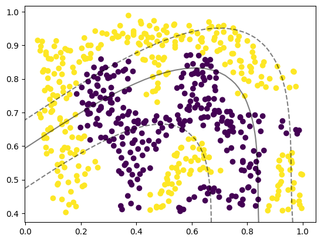

此次实验中还尝试过将使用poly作为核函数，设置其惩罚参数C = 10000时的情况，这需要运行相当长的时间，最后的出的测试集准确率为0.639，反而更低了！

- 结论：在使用rbf核函数时调节惩罚参数C的效果是C的值越大，分类效果越好！但是在使用poly核函数的模型中调节惩罚参数C的效果是C的值越大，分类效果反而越差！
### 3 Bonus（20）

- 对数据集data3进行SVM训练，并试图找到最好的一组超参数，撰写分析报告。

#### 3.1 分析数据集内容
- 分析：data3中的数据通过Python载入和输出可以看到其结构类型中较为重要的类别有”X“,”y”,“Xval”,“yval”。

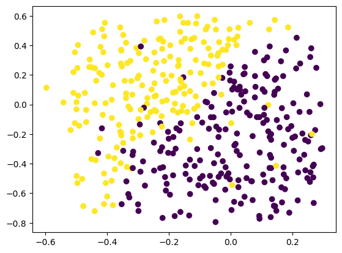

通过可视化上述四种类别的样本不难得出： 上述四种样本均可作为同一实验中的样本数据集。

#### 3.2 根据样本的可视化情况有以下判断

- 本次实验中选用“X”,“y”的集合作为训练样本，“Xval”，“yval” 的集合作为测试集样本。
- 核函数kernel的选择为【‘rbf’，‘linear’，‘poly’】
- 需要调整的参数主要是：惩罚参数C和gamma
- 使用的参数数据范围如下：
```python
C_inf = [0.01,0.05,0.1,0.5,1,5,10,50,100,500,1000]
gamma_inf = [10,5,1,0.5,0.1,0.05,0.01,0.005,0.001,0.0005,0.0001]
```

#### 3.3 模型构建以及测试集准确率收集
编写不同超参数对测试集得分情况的代码：
```python
def get_best_parameter(model_type,C_inf,gamma_inf):
    best_parameter = []
    for i in range(len(C_inf)):
        for j in range(len(gamma_inf)):
            model = svm.SVC(kernel = model_type,C = C_inf[i],gamma=gamma_inf[j])
            model.fit(data_train[:,:2],data_train[:,2].ravel())
            score_now = model.score(data_test[:,:2],data_test[:,2].ravel())
            best_parameter.append([C_inf[i],gamma_inf[j],score_now])
    return best_parameter
```

#### 3.4 可视化与分析

在使用’rbf‘作为核函数的模型的测试集准确率情况热力图如下所示：

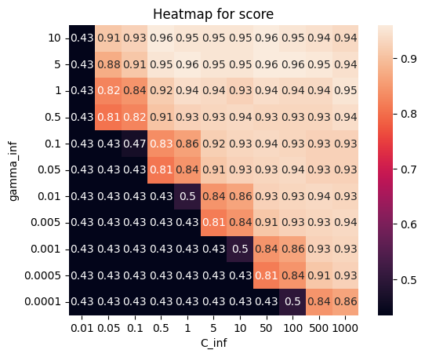

在热力图中可以得到的信息是：
- 使用rbf作为可函数的模型的测试集准确率最高为0.96，集中在上半部分
- 最高准确率需要的超参数的组合如下：

| C   | gamma | score |
|-----|-------|-------|
| 1   | 5     | 0.96  |
| 50  | 5     | 0.96  |
| 100 | 5     | 0.96  |

| 50  | 10    | 0.96  |

- 从运行效率来说，这四组数据中最好的应该是C= 1，gamma = 5
- 在此组数据下的测试集以及模型训练的非线性分类曲线可视化如下：

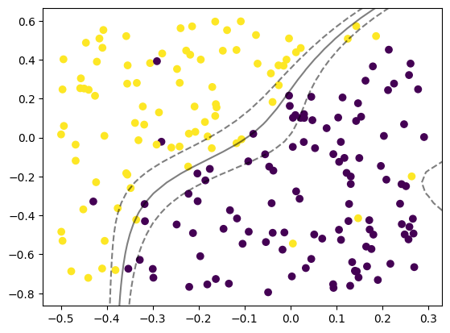

在使用’linear‘作为核函数的模型测试集准确率非常低，因为data3的数据集内容并不是线性可分割内容，准确率仅有0.548

- 总结：在使用SVM做类别判断时，需要先观察所判断数据集的样本状况，再选择相应的kernel函数作为核函数进行模型构建，在本次实验中
用到的最合适的kernal为’rbf‘,在这其中最佳的参数则是C = 1，gamma = 5！