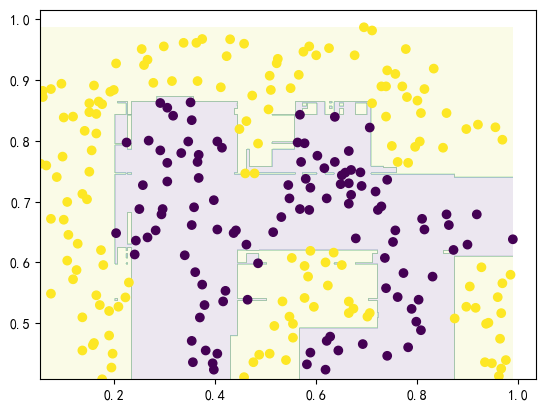
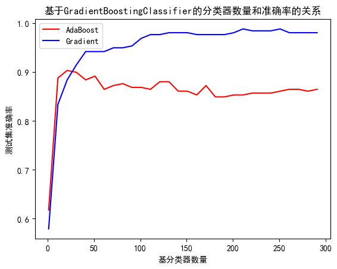
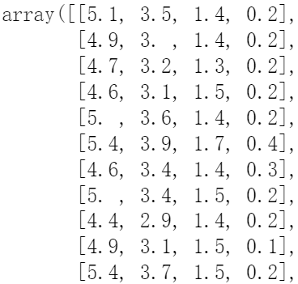
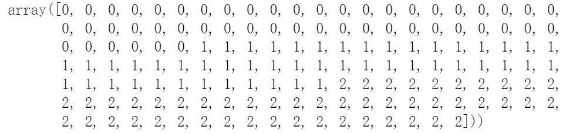
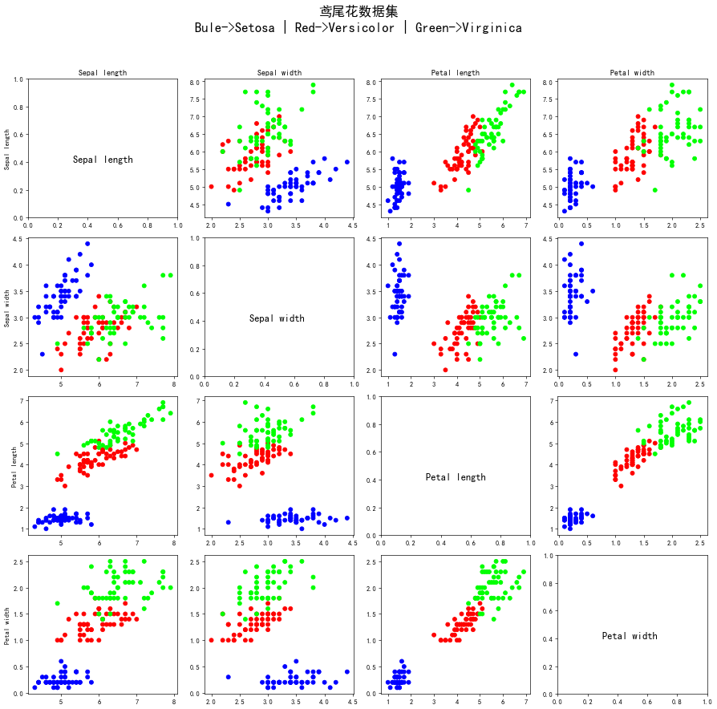
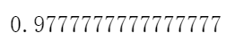
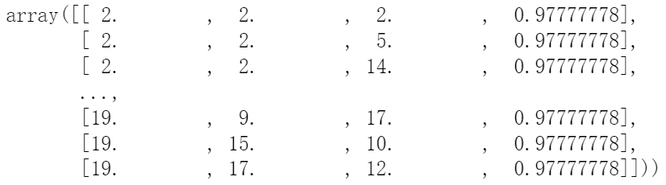

# HW4 集成模型

### 1 adaboost（50）

#### 1.1 输入数据集 （10）

data1.mat为分类数据集，每一行为一个样本，前两列为特征，最后一列为目标值。按照7:3的比率划分训练集和验证集。

**solution：**

```python
fileName = 'data1.mat'
data_base = loadmat(fileName)
plt.scatter(data_base["X"][:,0],data_base["X"][:,1],c=data_base['y'])
data_train,data_test = train_test_split(np.hstack((data_base['X'],data_base['y'])),test_size=0.3,random_state=True)
```

使用sklearn中的train_test_split函数分割整个数据集为7:3的比例的训练集和测试集数据。这之前还使用了np.hstack方法整合了data1中的X，y数据，方便后续进行整体分割。

#### 1.2 模型训练（20）

使用sklearn工具包，调用ensemble.AdaBoostClassifier接口对模型进行训练。

**solution:**
```python
clf = AdaBoostClassifier(learning_rate=0.5,n_estimators=100)
clf.fit(data_train[:,:2],data_train[:,2])
```
这里调用了ensemble.AdaBoostClassifier包，直接对模型进行了构建，而后填入data_train对模型进行训练

#### 1.3 分析（20）

- 可视化决策边界，并输出验证集准确率

**solution:**




```python
clf.score(data_test[:,:2],data_test[:,2])
```
这里得到的验证集准确率仅仅只有0.876

- 基于实验，分析不同的基分类器和基分类器数量对于模型性能的影响



在使用不同的基分类器adaboost和Gradient时明显发现，在Gradient作为基分类器对模型进行训练时，准确率是随着基分类器数量不断上升的
但是使用adaboost的模型的准确率却会在基分类器数量达到一定值之后下降。

### 2 随机森林（50）

#### 1.1 输入数据集（10）

data1.mat为分类数据集，每一行为一个样本，前两列为特征，最后一列为目标值。按照7:3的比率划分训练集和验证集。

**solution:**

```python
fileName = 'data1.mat'
data_base = loadmat(fileName)
plt.scatter(data_base["X"][:,0],data_base["X"][:,1],c=data_base['y'])
data_train,data_test = train_test_split(np.hstack((data_base['X'],data_base['y'])),test_size=0.3,random_state=True)
```
因使用的是同一文件。与任务一的文件导入、整合、分割均相同。

#### 1.2 模型训练（10）

使用sklearn工具包，调用ensemble.RandomForestClassifier接口对模型进行训练。

**solution:**
```python
clf = AdaBoostClassifier(n_estimators=100)
clf.fit(data_train[:,:2],data_train[:,2])
```
同样的，调用sklearn中的方法直接构建模型、填入参数、进行训练！

#### 1.3 分析（30)

- 换用不同的n_estimators、criterion、max_depth、min_samples_split ，分析其对于验证集准确率的影响。

**solution:**

```python
criterions = ['gini','entropy']
n_estimators_array = np.arange(2,20,step = 1)
max_depth_array = np.arange(2,20,step = 1)
min_samples_split_array = np.arange(2,20,step = 1)
def get_parameter_scores(criterion = 'gini'):
    gini_score = []
    for i in n_estimators_array:
        for j in max_depth_array:
            for k in min_samples_split_array:
                clf = RandomForestClassifier(n_estimators = i,criterion = criterion,max_depth = j,min_samples_split = k)
                clf.fit(data_train[:,:2],data_train[:,2])
                score = clf.score(data_test[:,:2],data_test[:,2])
                if criterion == 'gini':
                    gini_score.append([i,j,k,score])
                else:
                    entropy_score.append([i,j,k,score])
                print("now this parameter is working:n_estimators = {},max_depth = {},min_samples_split = {}".format(i,j,k))
    if criterion == 'gini':
        return gini_score
    else:
        return entropy_score
```

这里设置了四个不同的参数第一个为随机森林中的基分类器类别，后面三个参数设置为2开始是因为min_samples_split需要设置为＞1的情况下。
最后的到的最有参数如下：


在以上几组最优参数下的随机森林都能使得测试集的分类准确率达到99%以上。

### 3 Bonus（20）

#### 3.1 使用Iris数据集分别对adaboost和随机森林进行训练。

Iris也称鸢尾花卉数据集，是一类多重变量分析的数据集。数据集包含150个数据样本，分为3类，每类50个数据，每个数据包含4个属性。可通过花萼长度，花萼宽度，花瓣长度，花瓣宽度4个属性预测鸢尾花卉属于（Setosa，Versicolour，Virginica）三个种类中的哪一类。

**Iris数据集的调用**

```
from sklearn.datasets import load_iris
X, y = load_iris(return_X_y=True)
```

**solution：**




查看书鸢尾花数据内容可以发现，X数据内包含鸢尾花的四种属性的浮点类型的数值，鸢尾花的三个类别包含在y中。同时，我对本次数据进行了多维可视化，在这之中
能清楚的看到鸢尾花这些属性之间的两两相关性。

```python
model_ada = AdaBoostClassifier(learning_rate=1,n_estimators=80)
model_ada.fit(data_train[:,:4],data_train[:,4])
model_ada.score(data_test[:,:4],data_test[:,4])
```

使用AdaBoostClassifier训练出来的最好准确率如下：



```python
clf = RandomForestClassifier(n_estimators = i,criterion = criterion,max_depth = j,min_samples_split = k)
clf.fit(data_train[:,:4],data_train[:,4])
score = clf.score(data_test[:,:4],data_test[:,4])
```

使用RandomForestClassifier训练可得出最好的参数以及当前训练的最佳准确率如下：

